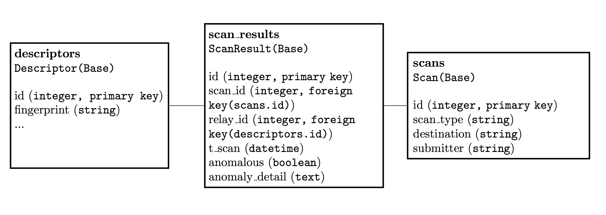

# spectator

Collection and analysis of automated relay scanning results to track malicious relay behavior on the Tor network

## Integrated Scanners

TODO

- [ ] Exitmap
- [ ] ur scanner here?

## Reporting and Collection

TODO: Setup OONI-collector and have people submit their results to it (TBD)

## Database

The database is currently a PostgreSQL database set up with `SQLAlchemy` via `spectator.models.create()`:

